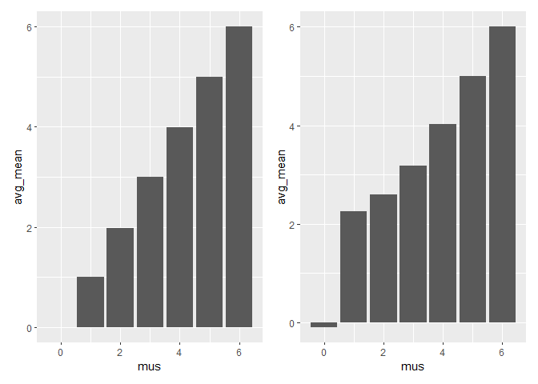

HW 5
================
Amanda Nagle
11/10/2020

## Problem 1

``` r
homicide_df = 
  read_csv("homicide-data.csv") %>%
  mutate( city_state = str_c(city, state, sep = "_"),
    resolved = case_when(
      disposition == "Closed without arrest" ~ "unsolved",
      disposition == "Open/No arrest" ~ "unsolved",
      disposition == "Closed by arrest" ~ "solved",
    )
  ) %>%
  filter(city_state != "Tulsa_AL") %>%
  select(city_state, resolved)
```

    ## Parsed with column specification:
    ## cols(
    ##   uid = col_character(),
    ##   reported_date = col_double(),
    ##   victim_last = col_character(),
    ##   victim_first = col_character(),
    ##   victim_race = col_character(),
    ##   victim_age = col_character(),
    ##   victim_sex = col_character(),
    ##   city = col_character(),
    ##   state = col_character(),
    ##   lat = col_double(),
    ##   lon = col_double(),
    ##   disposition = col_character()
    ## )

looking at the table

``` r
agg_df = homicide_df %>%
  group_by(city_state) %>%
  summarize(hom_total = n(),
            hom_unsolved = sum(resolved == "unsolved")
            )
```

    ## `summarise()` ungrouping output (override with `.groups` argument)

prop test on single city

``` r
prop.test(
  agg_df %>% filter(city_state == "Baltimore_MD") %>% pull(hom_unsolved),
  agg_df %>% filter(city_state == "Baltimore_MD") %>% pull(hom_total)) %>%
  broom::tidy()
```

    ## # A tibble: 1 x 8
    ##   estimate statistic  p.value parameter conf.low conf.high method    alternative
    ##      <dbl>     <dbl>    <dbl>     <int>    <dbl>     <dbl> <chr>     <chr>      
    ## 1    0.646      239. 6.46e-54         1    0.628     0.663 1-sample~ two.sided

``` r
results_df = 
  agg_df%>%
  mutate(
    prop_tests = map2(.x = hom_unsolved, .y = hom_total, ~prop.test(x=.x, n= .y)), tidy_tests = map(.x = prop_tests, ~broom::tidy(.x))
  ) %>%
  select(-prop_tests) %>%
  unnest(tidy_tests) %>%
  select(city_state, estimate, conf.low, conf.high)
```

``` r
results_df %>%
  mutate(city_state = fct_reorder(city_state, estimate)) %>%
  ggplot(aes(x = city_state, y= estimate)) +
  geom_point() +
  geom_errorbar(aes(ymin = conf.low, ymax = conf.high)) +
  theme(axis.text.x = element_text(angle = 90, vjust = 0.5, hjust = 1))
```

<!-- -->

## Problem 2

``` r
path_df = 
  tibble(
    path = list.files("longitudinal study"),) %>%
  mutate(
    path = str_c("longitudinal study/", path),
    data = map(path, read_csv)) %>%
  unnest(data) %>%
  mutate(group = substr(path, 20, 22), id = substr(path, 24, 25), id = str_c(group, id)) %>%
  select(-path) %>%
  pivot_longer(week_1:week_8, names_to = "week", names_prefix = "week_", values_to = "obs") %>%
  mutate(week = as.factor(week), id = as.factor(id))%>% group_by(id)

path_df %>%
  ggplot(aes(x = week, y = obs, group = id, color = group)) +
  geom_line()
```

<!-- -->

The experimental group’s scores tend to increase from the beginning to
the end of the study, while the control group’s scores tend to stay the
same of decrease.

## Problem 2

``` r
sim_mean_p = function(mu) {
  
  sim_data = tibble(
    samp = rnorm(30, mean = mu, sd = 5),)
  
   t.test(pull(sim_data, samp), mu=0) %>%
      broom::tidy() %>%
      mutate(reject= (p.value < .05)) %>%
     select( estimate, p.value, reject)
}

sim_mean_p(0)
```

    ## # A tibble: 1 x 3
    ##   estimate p.value reject
    ##      <dbl>   <dbl> <lgl> 
    ## 1    0.626   0.481 FALSE

``` r
sim_results = 
  tibble(mus = c(0, 1, 2, 3, 4, 5, 6)) %>% 
  mutate(
    output_lists = map(.x = mus, ~rerun(5000, sim_mean_p(mu = .x))),
    estimate_dfs = map(output_lists, bind_rows)) %>% 
  select(-output_lists) %>% 
  unnest(estimate_dfs)
```

Plotting

``` r
sim_results %>% 
  group_by(mus) %>%
  summarise(chance_reject = mean(reject)) %>%
  ggplot(aes(x= mus, y= chance_reject)) +
  geom_col()
```

    ## `summarise()` ungrouping output (override with `.groups` argument)

<!-- -->

``` r
sim_results %>% 
  group_by(mus) %>%
  summarise(avg_mean = mean(estimate)) %>%
  ggplot(aes(x= mus, y= avg_mean)) +
  geom_col()
```

    ## `summarise()` ungrouping output (override with `.groups` argument)

<!-- -->

``` r
all_data = sim_results %>% 
  group_by(mus) %>%
  ggplot(aes(x= mus, y= estimate, group = mus)) +
  geom_boxplot()

rejected = sim_results %>% 
  filter(reject == TRUE) %>%
  group_by(mus) %>%
  ggplot(aes(x= mus, y= estimate, group = mus)) +
  geom_boxplot()

all_data + rejected
```

<!-- -->
